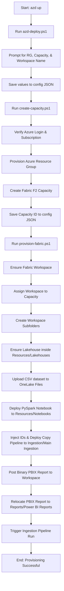

# Fabric Sales Analytics Accelerator

A beginner-friendly, production-ready Microsoft Fabric accelerator for creating a complete sales analytics solution with Azure/Fabric capacity, a Lakehouse pipeline template, sample sales data, a PySpark notebook transformation, and an automated Power BI dashboard.

This repository demonstrates how to package, deploy, and govern Microsoft Fabric infrastructure-as-code (IaC) using Azure CLI, Fabric REST APIs, PySpark compute, and GitHub Actions CI/CD pipelines.

---

## Features

- **One-Click Deployments:** Complete Azure-to-Fabric provisioning via interactive `azd up` integration.
- **Enterprise Folder Cleanliness:** Automatically creates standard subfolders (`Data Ingestion`, `Resources`, `Reports`) in the workspace to organize assets by role.
- **Data Ingestion Copy Pipeline:** Multi-pipeline/notebook array capability to load csv/tabular datasets into managed Lakehouse Delta tables.
- **Spark Transformations:** Out-of-the-box PySpark notebook for computing regional sales aggregates.
- **Automated Dashboard Publishing:** Uploads and polls Power BI desktop `.pbix` templates to the Fabric workspace via binary imports and relocates them into the workspace folders.
- **CI/CD Validation:** Automatically validates JSON, PowerShell syntax, and resource availability on push/pull requests.

---

## 1. Quick Start & Deployment Guide

Follow these steps in order to deploy the accelerator to Azure and Microsoft Fabric.

### Prerequisites
1. **Azure CLI:** Ensure Azure CLI is installed and logged in (`az login`).
2. **Fabric Extension:** Install the Microsoft Fabric extension:
   ```powershell
   az extension add --name microsoft-fabric --allow-preview true
   ```
3. **Active Azure Subscription:** Verify your active subscription via `az account show`.

### Configuration Layer
Open [config/accelerator-config.json](config/accelerator-config.json). For a fresh run, you can leave the ID fields blank—our automation scripts will discover the resources and write them back into this config automatically!
```json
{
  "workspaceName": "SalesAnalyticsWorkspaceNew",
  "workspaceId": "",
  "lakehouseName": "SalesLakehouse",
  "lakehouseId": "",
  "pipelines": [
    {
      "pipelineName": "salesdatapipeline",
      "pipelineId": "",
      "templateName": "salesdatapipeline.json",
      "sourceFile": "sales.csv",
      "destinationTable": "sales",
      "destinationFolder": "MainDataIngestion",
      "runAfterProvisioning": true
    }
  ],
  "notebooks": [
    {
      "notebookName": "sales_transform",
      "notebookId": "",
      "destinationFolder": "Notebooks"
    }
  ],
  "pbixFile": "SalesDashboard.pbix",
  "pbixFolder": "PowerBIReports",
  "subscriptionId": "",
  "resourceGroup": "rg-fabric-dev",
  "capacityName": "fabriccapacitydev",
  "capacityId": "",
  "location": "CentralIndia",
  "capacitySku": "F2",
  "loadSampleData": true
}
```

---

### Choose Your Deployment Method

#### Option A: One-Click Interactive Deployment (`azd up`)
If you have the **Azure Developer CLI (`azd`)** installed, you can trigger the entire end-to-end deployment with a single interactive command:
```powershell
azd up
```
This will automatically prompt you for:
- Your desired **Azure Resource Group Name**
- Your desired **Fabric Capacity Name**
- Your desired **Fabric Workspace Name**

Once entered, `azd` will configure your config JSON, deploy your Azure capacity, set up the Fabric workspace folder structure, upload data, deploy notebooks and pipelines, and publish your Power BI report!

#### Option B: Step-by-Step Manual Deployment
If you do not use `azd`, run the deployment scripts manually in order:

##### Step 1: Create Fabric Capacity
Create your Azure Resource Group and Microsoft Fabric F2 capacity:
```powershell
powershell -NoProfile -ExecutionPolicy Bypass -File .\infra\create-capacity.ps1
```
The script will prompt you for your Azure subscription, resource group name, and capacity name (pressing Enter uses config defaults).

##### Step 2: Provision Fabric Accelerator
Run the main Fabric asset provisioning orchestrator:
```powershell
powershell -NoProfile -ExecutionPolicy Bypass -File .\scripts\provision-fabric.ps1
```

---

## 2. Technical Architecture & Ingestion Flow

The accelerator coordinates resources in two logical phases: **Infrastructure Provisioning** and **Fabric Asset Provisioning**.



### Configuration Schema Reference
Below is an overview of the key properties in [config/accelerator-config.json](config/accelerator-config.json):

| Property | Description | Mode |
| :--- | :--- | :--- |
| `workspaceName` | Name of the Fabric workspace to create/use. | User Defined |
| `workspaceId` | Unique ID of the created Fabric Workspace. | Auto-Populated |
| `lakehouseName` | Name of the Fabric Lakehouse to create/use. | User Defined |
| `lakehouseId` | Unique ID of the created Lakehouse. | Auto-Populated |
| `pipelines` | Array of pipelines to configure, deploy, and trigger. | User Defined |
| `notebooks` | Array of Spark notebooks to deploy. | User Defined |
| `pbixFile` | Local `.pbix` file path under `powerbi/` to deploy. | User Defined |
| `pbixFolder` | Workspace folder to store the uploaded report. | User Defined |
| `subscriptionId` | Active Azure subscription ID for billing. | Auto-Populated |
| `resourceGroup` | Name of the capacity Resource Group. | User Defined |
| `capacityName` | Name of the Fabric Capacity to deploy/verify. | User Defined |
| `capacitySku` | Capacity size (minimum F2 capacity). | User Defined |

---

## 3. Data Lifecycle & Transformation Architecture

### Phase 1: Raw Ingestion (Data Pipeline Copy Activity)
The deployment script takes the copy pipeline template [config/salesdatapipeline.json](config/salesdatapipeline.json) and replaces placeholders (`#{workspaceId}#`, `#{lakehouseId}#`, etc.) to generate a ready-to-deploy pipeline under `pipelines/`.
The copy pipeline takes `sales.csv` from OneLake `Files/` and maps it directly to a managed Delta Table named `sales` (`Tables/sales`), performing automatic data-type conversions on schema mappings.

### Phase 2: PySpark Notebook Transformations
Once the raw logs are loaded, the Spark transformation notebook [notebooks/sales_transform.py](notebooks/sales_transform.py) aggregates regional KPIs:

```python
from pyspark.sql import functions as F

source_table = "sales"
summary_table = "sales_summary_by_region"

# Read the raw table
sales_df = spark.table(source_table)

# Group by Region and compute KPIs
summary_df = (
    sales_df
    .groupBy("Region")
    .agg(
        F.count("*").alias("OrderCount"),
        F.sum("SalesAmount").alias("TotalSalesAmount"),
        F.avg("SalesAmount").alias("AverageSalesAmount"),
        F.min("OrderDate").alias("FirstOrderDate"),
        F.max("OrderDate").alias("LastOrderDate"),
    )
    .orderBy("Region")
)

# Write as an overwrite delta table
summary_df.write.mode("overwrite").format("delta").saveAsTable(summary_table)
display(summary_df)
```

---

## 4. CI/CD & Validation Pipelines

The repository includes a comprehensive GitHub Actions workflow at [.github/workflows/ci.yml](.github/workflows/ci.yml) consisting of two stages:

1. **`validate` (Runs on every Push and PR):**
   - **JSON Linting:** Validates the formatting of `config/accelerator-config.json` and `config/salesdatapipeline.json`.
   - **PowerShell Tokenizer:** Uses standard PowerShell tokenization parsing to assert that all scripts (`create-capacity.ps1`, `deploy.ps1`, `provision-fabric.ps1`, `azd-deploy.ps1`) are 100% free of syntax errors.
   - **Asset Integrity:** Verifies that required local files (`sales.csv`, `SalesDashboard.pbix`, `sales_transform.py`) exist.
2. **`provision` (Manual Trigger Only via `workflow_dispatch`):**
   - Connects to Azure using a service principal/identity via OIDC (`azure/login@v2`).
   - Installs the Microsoft Fabric CLI Extension.
   - Automatically provisions the full Azure capacity (`create-capacity.ps1 -UseConfig`) and deploys the entire Fabric workspace and pipeline hierarchy (`provision-fabric.ps1`).

---

## 5. Architecture Highlights & Design Best Practices

- **Strict Idempotency:** Every script is engineered with the "Ensure" pattern. It inspects if the resource group, capacity, workspace, folder structure, lakehouse, pipeline, notebook, or report already exists, preventing dual allocation and making it 100% safe to rerun.
- **Enterprise Workspace Folders:** Instead of deploying assets to a flat workspace, this accelerator structures files using the Fabric Folders API (`Data Ingestion`, `Resources`, and `Reports` directories) to match professional governance standards.
- **Zero Hardcoding:** All configuration variables are extracted to [config/accelerator-config.json](config/accelerator-config.json) to allow flawless environment promotions (Dev, Test, Prod).
- **Delta Lake Storage:** Raw sales data and summary metrics are stored as Delta Lake tables to enable full transactional ACID compliance and time travel.
